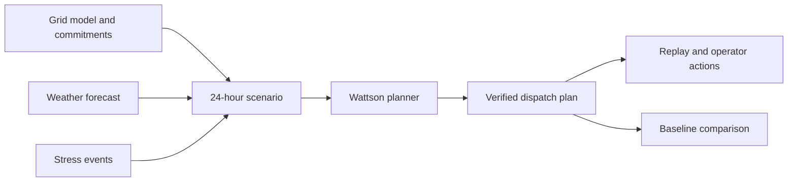

# Wattson

> Resilient energy planning for community microgrids.

Wattson helps grid operators prepare a 24-hour operating plan before weather shifts, demand surges, or fuel deliveries fail. It combines live weather, local grid constraints, and service commitments to decide when to use renewable power, batteries, and diesel generation.

The result is an explainable plan that protects critical services such as health centers, water systems, communications, and cold storage. Operators can replay the day, inspect each decision, and compare Wattson's response with a baseline plan.

## The problem

Remote and weak-grid communities often depend on a small mix of solar, wind, batteries, and diesel generation. A forecast error or delayed fuel delivery can force an operator to make high-impact decisions with little time and incomplete information.

Most planning tools show energy totals. They do not connect those totals to service commitments, operational constraints, and real disruption scenarios.

## Our solution

Wattson turns a community grid into an interactive operating model:

- Model generation, storage, demand, and the connections between them.
- Define critical, essential, and flexible service commitments.
- Import a seven-day Open-Meteo forecast and translate it into operating actions.
- Design stress scenarios with renewable shortfalls, demand surges, and delayed fuel deliveries.
- Calculate a 96-step dispatch plan at 15-minute resolution.
- Replay energy flow and see operator notifications as conditions change.
- Compare cost, emissions, fuel use, curtailed energy, and commitment outcomes against a baseline.

## How it works



The planner applies active events before it calculates dispatch. It uses a Pyomo and HiGHS mixed-integer model when the optimizer is available. A deterministic Go heuristic remains available as a fallback.

The plan follows physical battery and generator limits. It also accounts for reserve energy, startup fuel, minimum runtime, ramp rates, deadlines, cost, and emissions. The backend verifies power and energy balance before it accepts an optimized result.

## Demo experience

The repository includes complete scenarios for four community grids:

| Site                        | Location                | Example operating risk                   |
| --------------------------- | ----------------------- | ---------------------------------------- |
| Spiti Valley Community Grid | Himachal Pradesh, India | Dense cloud and delayed diesel delivery  |
| Ada Foah Coastal Grid       | Greater Accra, Ghana    | Storm cover and an evening demand surge  |
| Sierra Verde Health Grid    | Oaxaca, Mexico          | Mountain cloud and road-delayed fuel     |
| Char Kukri Mukri Grid       | Bhola, Bangladesh       | Monsoon cover and cyclone-shelter demand |

A useful demo flow is:

1. Open a seeded site and review its capacity and commitments.
2. Open **Forecast** to see live weather and suggested operating actions.
3. Open **Operate** to inspect the grid topology.
4. Select or design a disruption scenario.
5. Calculate the plan and replay the 24-hour response.
6. Review commitment outcomes, costs, emissions, and the baseline comparison.

## Technology

| Layer                | Main tools                                                              |
| -------------------- | ----------------------------------------------------------------------- |
| Web application      | React 19, TanStack Start, TanStack Query, Tailwind CSS, ECharts, Motion |
| API and domain model | Go 1.24, `net/http`, SQLite, sqlc                                       |
| Optimization         | Python 3.11+, Pyomo, HiGHS                                              |
| Deployment           | Cloudflare Workers through Alchemy, Linux systemd for the Go service    |
| Tooling              | Bun workspaces, Vite+                                                   |

## Repository structure

```text
apps/
├── backend/              # Go API, scheduler, persistence, and seed data
│   ├── internal/         # Domain, database, weather, scheduler, and comparison code
│   ├── optimizer/        # Pyomo and HiGHS optimization service
│   └── seeddata/         # Four complete community scenarios
└── web/                  # TanStack Start operator interface
packages/
├── config/               # Shared TypeScript configuration
├── infra/                # Cloudflare deployment definition
└── ui/                   # Shared React components and theme
deploy/                   # VPS systemd unit for the backend
```

## Run locally

### Prerequisites

- [Bun](https://bun.sh/) 1.3 or newer
- [Go](https://go.dev/) 1.24 or newer
- [Python](https://www.python.org/) 3.11 or newer
- [uv](https://docs.astral.sh/uv/) for the optimization environment

### Installation

1. Install the JavaScript dependencies.

   ```bash
   bun install
   ```

2. Create the web environment file.

   ```bash
   cp apps/web/.env.example apps/web/.env
   ```

3. Install the optimizer dependencies.

   ```bash
   cd apps/backend/optimizer
   uv sync
   cd ../../..
   ```

4. Start the web application and API.

   ```bash
   bun run dev
   ```

5. Open [http://localhost:3001](http://localhost:3001).

The Go API runs at [http://localhost:8080](http://localhost:8080). SQLite stores data in `local.db`, relative to the backend working directory.

To run without the Python optimizer, disable it before startup:

```bash
MILP_ENABLED=false bun run dev
```

## Configuration

| Variable           | Default                      | Purpose                                 |
| ------------------ | ---------------------------- | --------------------------------------- |
| `BACKEND_URL`      | `http://localhost:8080`      | Backend URL used by the TanStack server |
| `PORT`             | `8080`                       | Go API port                             |
| `DATABASE_PATH`    | `local.db`                   | SQLite database path                    |
| `WEB_ORIGINS`      | `http://localhost:3001`      | Comma-separated browser origins         |
| `MILP_ENABLED`     | `true`                       | Enables the Python optimizer            |
| `MILP_PYTHON_PATH` | `optimizer/.venv/bin/python` | Python executable for the optimizer     |
| `MILP_SCRIPT_PATH` | `optimizer/solve.py`         | Optimizer entry point                   |
| `MILP_TIMEOUT`     | `8s`                         | Maximum time for one optimization run   |

## Quality checks

Run the repository checks:

```bash
bun run check
```

Run the optimizer tests:

```bash
cd apps/backend/optimizer
uv run pytest
```

The Go test suite covers API behavior, persistence, comparisons, weather caching, scheduling constraints, optimizer integration, and solution verification.

## API and deployment

The API contract is in [`apps/backend/openapi.yaml`](apps/backend/openapi.yaml). Backend details and VPS instructions are in [`apps/backend/README.md`](apps/backend/README.md).

The web application deploys to Cloudflare through Alchemy. The Go API deploys as a standalone binary behind a TLS reverse proxy.
